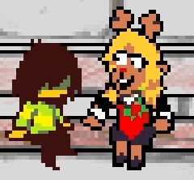
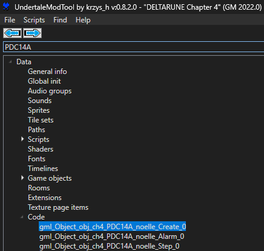
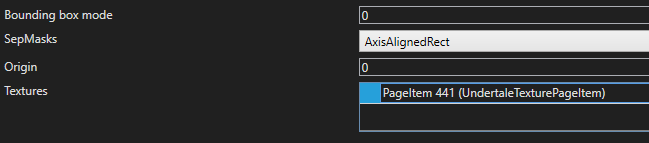

# noe_ferris

    I stood up and saw. Saw through the outlines.
    Saw the reflections bouncing in, around, back out.
    The dream's twilight, marred, scarred.

In normal words: this is a fan-made potential Kris/Noelle ferris wheel scene.

## YouTube video

## Background
I was listening to one of [Andrew Cunningham](https://www.youtube.com/@andrew_cunningham)'s ELEKTIONTRÜCKUNG streams to fall asleep, and this scene came to me in a half-dream.
I got up, but it didn't leave my head as it was supposed to.

I couldn't stop thinking about it, so I forcefully evicted it onto this canvas over the weekend.

The cutscene system is cool so this was fun.

You may notice the background art sucks - that's because I suck at art. Basically, every sprite that doesn't suck comes from the game itself (some of them unused).

## Play it yourself
You'll need to download [UndertaleModTool](https://github.com/UnderminersTeam/UndertaleModTool) to modify the game files.

### Installation

1. Get a save in Noelle's kitchen (for convenience)
2. Go to the game's install directory (right-click the game in Steam and go to `Manage` -> `Browse local files`)
3. Run UndertaleModTool and open `DELTARUNE/chapter4_windows/data.win` with it
4. Back up your original `data.win` (copy it somewhere)
5. Install the mod (see below)
6. Save the `data.win` with `Ctrl+S` - double check you're overwriting `chapter4_windows/data.win`
7. Launch the game and go into Noelle's room. When the cutscene ends, you'll be teleported back to the kitchen.
    - Make sure you *don't* do any funny things like entering the room from the vent, because I have no idea what will happen (you will probably crash)
8. To uninstall the mod, copy the original `data.win` back over the modified one.
    - If you don't have a backup, you'll have to verify files on Steam.

#### Automatic installation:

Open the `Scripts` menu in UTMT, select `Run other script...`, and find `Install.csx` (you did download the repo, right?)

#### Manual installation:

1. Find and replace assets from this repo into the `data.win` (see [How to replace assets](#how-to-replace-assets) below):

| New file | Type | Replaces |
| -------- | ---- | -------- |
| [`noe_ferris_Create_0.gml`](./noe_ferris_Create_0.gml) | Code   | `gml_Object_obj_ch4_PDC14A_Create_0` |
| [`noe_ferris_Step_0.gml`](./noe_ferris_Step_0.gml)   | Code   | `gml_Object_obj_ch4_PDC14A_Step_0` |
| [`art/bg_noellehouse_noelle.png`](./art/bg_noellehouse_noelle.png)          | Sprite | `bg_noellehouse_noelle` |

2. After replacing assets, open `room_lw_noellehouse_noelle` in the Room section
3. Delete the following (right-click to open the menu):
    - The layers `GIVE_DEPTH` and `TILES_Vents` (delete the layers themselves)
    - Inside the `OBJECTS_MAIN` layer, `obj_homealone_vent_hidden`, `obj_homealone_vent_overlay`, and `obj_noellehouse_noelle`

## How to replace assets

### Code
Using `noe_ferris_Create_0.gml` as an example:
1. Open the new file in a text editor (recommend [Notepad++](https://notepad-plus-plus.org/downloads/) or [VSCode](https://code.visualstudio.com/))
2. Copy all the code in the new file (select all with `Ctrl+A` and copy with `Ctrl+C`)
3. Locate the code entry that should be replaced
    - Use the search bar in the top left to find "PDC14A" in the `Code` section
     
    - Double-click to open the code entry (make sure it's `Create_0` and not `Step_0`)
    - You should see decompiled code for the script.
4. Now, just select all code in the script with `Ctrl+A` and paste with `Ctrl+V`.

Done!

### Sprite
1. Locate the sprite
2. Under 'Textures', double-click the "PageItem" you want to replace
    - It will say something like `PageItem 441 (UndertaleTexturePageItem)`

3. Click `Import` and select the image to replace the sprite with
